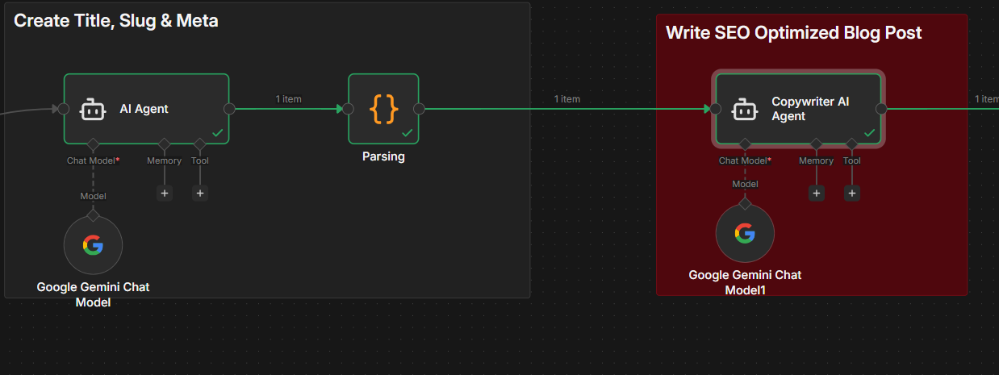

# 🚀 AI Blog Automation Agent (n8n)
## 📌 Overview

This project is an AI-powered content automation system that generates SEO-optimized blog posts using real-time data and publishes them automatically to Blogger.

## ⚙️ Features
- 🧠 AI-generated SEO titles, meta, and content
- 🖼️ Automatic image fetching via Pexels API
- 📰 Real-time topic extraction from news APIs
- ✍️ HTML blog generation with structured content
- 🚀 Auto publishing to Blogger
- 🔁 Fully automated workflow using n8n

## 🏗️ Architecture

News API → AI SEO Generator → Image API → AI Content Writer → Blogger API

## 🧠 Tech Stack
- n8n (workflow automation)
- Google Gemini API
- Blogger API
- Pexels API
- REST APIs

## 🔐 Environment Variables

Create a `.env` file:

```env
PEXELS_API_KEY=
GEMINI_API_KEY=
BLOGGER_CLIENT_ID=
BLOGGER_CLIENT_SECRET=
```

## 🚀 How to Run
1. Import `workflow.json` into n8n
2. Set credentials (API keys)
3. Execute workflow

## 🌐 Deployment Options
You can run this project in several ways:
- **Local n8n**: Run n8n locally on your machine.
- **n8n Cloud**: Use the paid n8n cloud service.
- **Render**: Deploy n8n for free on Render.

## 📸 Screenshots



## 📈 Use Case
- Automated blogging
- SEO content generation
- Affiliate marketing automation

## 👨💻 Author
Vishwas
